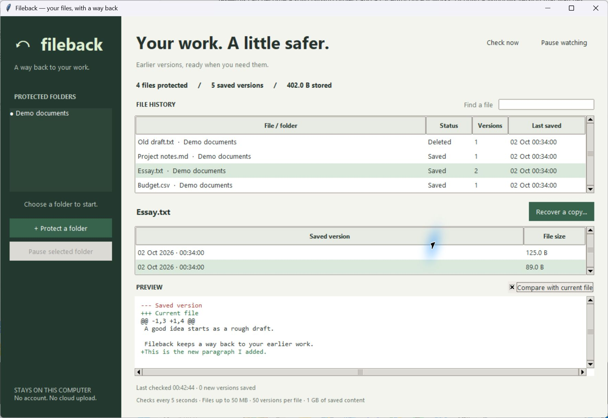

# Fileback

**Your files, with a way back.**

**Status: v0.1 alpha / portfolio project.** The source is ready to explore and test. This is not a production backup service or a certified virus-free download. Start with disposable test files. See [SECURITY.md](SECURITY.md) for the checks and remaining limits.

Fileback is a small Windows-first desktop app that saves earlier versions of files in folders you choose. Recover an old essay, undo an accidental overwrite, or bring back a deleted file as a separate copy.



## What it does

- Watches chosen folders while the app is open, including when minimized.
- Saves changed files every five seconds, without duplicating unchanged content.
- Keeps history after a file is deleted.
- Shows saved text and compares it with the current file.
- Recovers a separate copy and refuses to overwrite an existing file.
- Checks SHA-256 hashes before recovery.
- Compresses and shares identical content between saved versions.
- Allows pausing all watching or individual folders.
- Stores everything locally. No account, network requests, or paid service.

## Try it

**Windows executable:** the Windows workflow builds an unsigned `Fileback.exe` artifact. It does not need Python installed. There is no reviewed public binary release yet. Windows may show an unknown-publisher or reputation warning for unsigned builds. Do not disable your security software to run it. You can inspect and run the source instead.

**From source:** install Python 3.11 or newer with Tk support, then run these commands from the project folder:

```powershell
python run.py
```

There are no third-party runtime dependencies. Python's standard Windows installer includes Tk; some Linux distributions need a separate Tk package. Windows is the tested platform for this first version.

1. Click **Protect a folder** and select a small folder to try first.
2. Wait for the first check. Your existing files become the starting versions.
3. Edit and save a file. Wait at least five seconds for another check.
4. Select the file and an earlier version.
5. Click **Recover a copy** and choose a new filename.

The original file stays unchanged. **Compare with current file** highlights additions in green and removals in red. Comparisons go from the selected saved version to the current file.

## Why use this if OneDrive or Google Drive already exists?

You might not need it. [OneDrive](https://support.microsoft.com/en-us/onedrive/restore-a-previous-version-of-a-file-stored-in-onedrive) and [Google Drive](https://support.google.com/drive/answer/2409045) already offer file versions. If your cloud history meets your needs, keep using it.

Fileback is for people who want a separate, local record of chosen folders without uploading those files or signing into a service. It also gives a simple text comparison and recovery as a new copy. It can watch folders outside a cloud-sync folder.

It does not provide remote backup, cross-device sync, sharing, or protection against a failed disk. Windows File History and other established tools also cover parts of this use case. The goal here is a small, understandable local-history tool and a practical software engineering project, not a claim that existing backup tools are inadequate.

## Current limits

This is a working first version, not a replacement for an off-device backup.

- It cannot recover anything from before you first protected the folder.
- Watching stops when you close the app. Minimize it to keep watching. There is no startup service or tray mode yet.
- Checks happen every five seconds **after the previous scan finishes**. Large folders take longer. Changes made and undone between checks can be missed.
- Files larger than 50 MB are skipped. Locked, unreadable, or changing-during-read files are retried on later scans; an error appears for unreadable files.
- Text preview and comparison support UTF-8 files up to 1 MB. Other saved file types can still be recovered.
- Keeps up to 50 versions per file and up to 1 GB of compressed file content. Oldest versions are removed first when those limits are reached. Database metadata and journal files add some disk overhead, and the database may retain free space for reuse.
- `.git`, `node_modules`, `__pycache__`, `.venv`, `venv`, Windows system/recycle folders, symlinks, and junctions are excluded. Recovery filenames containing `.recovered-` are also excluded to avoid saving the recovered copies repeatedly.
- A rename is treated as a deleted old path and a new file. Overlapping watched folders are rejected to avoid duplicate tracking.
- Histories are not encrypted. They have the same computer/account trust boundary as other local files.
- Protecting a folder also saves sensitive files inside it. Deleted secrets can remain in history until retention removes them. Do not protect folders containing credentials or private information you do not want copied locally.
- History on the same disk will not protect against disk failure. Use another backup for that.

## Where history lives

On Windows, history is stored in `%LOCALAPPDATA%\Fileback\history.sqlite3`. It is separate from the project and your protected folders. Pausing a folder leaves its history intact. No personal history is included in the source archive or executable.

For a separate test history:

```powershell
python run.py --data-dir ./test-history
```

## How it works

The Tk desktop interface talks to a background polling worker. The worker reads stable file contents, hashes them with SHA-256, and compares the hash with the last saved version. New bytes are compressed with zlib and written with their version metadata in one SQLite transaction. Identical hashes share one stored blob. SQLite WAL mode supports local transactional storage.

Recovery decompresses the saved bytes, verifies their size and hash, and creates the destination with exclusive-create mode. It never replaces an existing destination, even if another process creates the file while the save dialog is open. File timestamps and permissions are not restored; recovery restores the bytes.

```text
Selected folders → polling worker → hash + compression → SQLite history
                                                           ↓
Desktop history + preview ← saved versions → verified recovery copy
```

## Tests

```powershell
python -m unittest discover -s tests -v
```

Tests cover edits, binary and empty files, deduplication, deletion and recreation, safe recovery, corrupt content, bounded decompression, storage limits, unavailable folders, pause/resume, persistence after restart, and the actual desktop worker. Desktop tests create temporary Tk windows, so they need a graphical session. The symlink integration test is skipped if Windows does not allow creating symlinks.

## Build a Windows executable

Build on Windows, from a virtual environment:

```powershell
python -m venv .venv
.\.venv\Scripts\python -m pip install -r requirements-build.txt
.\.venv\Scripts\python -m PyInstaller --noconfirm --clean --onefile --windowed --name Fileback run.py
```

The result is `dist/Fileback.exe`. The GitHub Actions workflow runs tests, checks Python code with Bandit, audits the build dependencies with pip-audit, and builds an executable artifact on Windows. Check the latest workflow result before trusting a downloaded artifact. These checks do not replace antivirus scanning or an independent security review.

## Next steps

- Tray mode and an optional start-at-login setting.
- Configurable retention, file-size limits, and folder exclusions.
- Event-based watching for larger folders.
- Better rename tracking and encrypted history.
- Packaging and testing on macOS and Linux.

## CV wording

> Built Fileback, a Python desktop app that keeps local file history and safely recovers earlier versions, using SQLite, background workers, SHA-256 checks, and automated tests.

Use this as an AI-assisted project and be ready to explain the storage model, safe recovery, polling trade-offs, and tests. Avoid claims about users or adoption until you have them.

## License

MIT. See [LICENSE](LICENSE).
